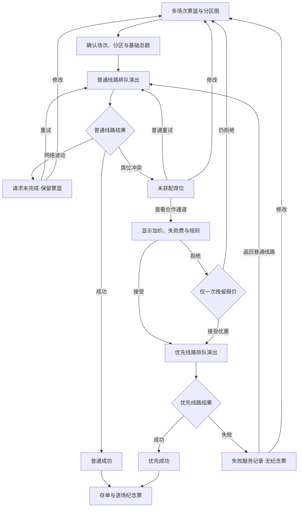

# 票务小游戏体验深化建议

- 文档类型：建设建议草稿
- 状态：候选，待人工判断
- 规划效力：不直接约束正式蓝图或源码；只有经人工采纳并另行授权正式迁移后，相关结论才可改变票务契约
- 分析基线：`dev_blueprint` 提交 `501f25b`；当前 active `BP-MOD-TICKETING`、`BP-FND-DOMAIN`、`BP-CNT-CORE` 与三国家版本票务实现；本地参考 `local-reference-materials/03_票务状态与购票.mmd`、`04_购票结果与黄牛支线.mmd`、`05_成就与观演凭据.mmd`
- 目的：从三份旧流程中筛选仍有价值的场馆、分区、黄牛支线、结果与印章构想，在不推翻现有票篮和纪念票能力的前提下，形成更可信、短促、有叙事张力且不鼓励反复刷概率的票务体验建议
- 非目标：把旧 MMD 直接恢复为产品契约；立即修改正式蓝图或源码；开放里站异常购票；引入真实支付、账号、长期成就、通知权限、外部票务平台或逐座位选座

## 正文

以下现有契约不属于本草稿的变更范围，后文不再逐项重复：多场次票篮、每场一张、仅使用 LMD、标签页生命周期、跨国家版本保持语义状态、成功结果冻结、存单与逐场纪念票、SVG 下载与打印、无真实交易，以及无 JavaScript 时回退到“暂未开票”页面。本草稿只描述相对该基线的增量。

### REC-01｜将三份旧流程作为候选池而非现行规格

- 状态：候选，待人工判断
- 优先级：P0
- 价值：保留旧构想中仍有创造力的部分，同时阻止单场次、双币、长期成就等过时假设覆盖已经实现的多场次票篮与会话状态契约
- 成本：低；仅涉及规划取舍
- 推荐结论：选择性吸收，不按旧图节点逐项复刻；现有正式蓝图和运行时事实优先于旧 MMD

#### REC-01 原因

三份旧图形成于当前票务模组之前，其中既有值得复用的体验种子，也有已经被后续决策替代的产品假设。它们之间还混用了“销售状态”“单次尝试结果”“完整体验结局”“长期成就”四种不同层级，若直接实现会制造重复状态和高成本循环。

| 来源 | 候选内容                                    | 取舍       | 理由                                                                                                        |
| ---- | ------------------------------------------- | ---------- | ----------------------------------------------------------------------------------------------------------- |
| `03` | 可购、未开售、候补、免票、外部主办五种状态  | 延后       | 当前只有可购、未开售和历史快照不可购有真实消费者；不为没有场次使用的状态扩张数据模型                        |
| `03` | 单场次购票                                  | 替代       | 当前已经支持多场次票篮，每个场次限一张；座位图应嵌入每个票篮条目而非把流程退回单场次                        |
| `03` | 完整分区图                                  | 采纳并重构 | 它能同时补足场馆可信度、价格理解和选择反馈，是三份旧图中性价比最高的新增能力                                |
| `03` | `D` 区与双币显示                            | 不采纳     | 当前稳定分区为 `C / B / A / S / BOX`，唯一结算单位为 LMD；新增枚举和第二货币没有实际内容价值                |
| `04` | 普通成功、网络、失败、加价线路和一次性挽留  | 采纳并收敛 | 与现有状态机一致，可通过更明确的结果语义和有限次数控制提升讽刺性                                            |
| `04` | 失败也收取服务费                            | 有条件采纳 | 只能表现为当前小游戏内的模拟失败服务记录，不能声称真实账户已扣款                                            |
| `05` | 七个稳定结果语义                            | 拆分重构   | 将结果、线路、报价变体和旅程经历分开建模，避免为组合状态建立七个相互重叠的枚举                              |
| `05` | 唯一成就集合、导演计数、30 天续期与路线提示 | 不采纳     | 与标签页生命周期冲突，会诱导刷概率并把短小游戏扩张为低价值的长期收集系统                                    |
| `05` | 组合印章、随机票纹和多媒介凭据              | 部分采纳   | 组合印章和可复现票纹有叙事价值；当前 SVG、打印和 HTML 可读信息已经覆盖核心媒介，不急于增加 PNG 和纯文本下载 |

#### REC-01 最小落地

只迁移后续建议中经人工采纳的增量。未被当前可购场次消费的销售状态、货币、下载格式和长期系统不预留空字段、空页面或兼容分支。

#### REC-01 可观察验收

- 正式规划能够逐项说明旧构想的去向，不会把旧 MMD 当成与正式蓝图平行的事实源；
- 新流程继续消费现有 `TicketBasket` 和三国家版本内容；
- 未采纳内容不在源码中留下枚举、文案或隐藏入口。

#### REC-01 非目标

不删除本地参考文件，不把取舍表解释为对其历史价值的否定，也不要求以后永远禁止候补、免票或外部主办场次。

### REC-02｜为每个可购场次提供场馆情境与同步分区图

- 状态：候选，待人工判断
- 优先级：P0
- 价值：让分区和价格从抽象下拉选项变成可理解的观演空间，同时把现有城市、场馆和舞台性质转化为可信的剧团服务信息
- 成本：中；需要三套示意拓扑、类型化关联、无障碍交互和三国家版本短文案
- 推荐结论：采纳“按场次消费的分区示意图”，不建设逐座位选座或未经依据的真实建筑平面图

#### REC-02 原因

当前三个可购场次分别位于“大剧院主舞台”“宫廷剧院镜厅”和“旧车站临时舞台”，空间性格明显不同，但运行时使用同一个 `createFrontTicketOffers()`，全部提供 `C / B / A / S / BOX`。尤其临时舞台仍提供包厢，会在加入座位图后立即暴露为内容失真。

座位图应是剧团发布的“分区示意”，表达舞台方向、楼层或看台关系、视线倾向、分区和基础价格，不冒充可验证的建筑测绘或具体座号。现阶段建议形成三种互不换皮的空间语法：

| 场次                    | 示意拓扑                                 | 推荐分区关系                                       | 内容校正                                           |
| ----------------------- | ---------------------------------------- | -------------------------------------------------- | -------------------------------------------------- |
| 特里蒙大剧院·主舞台     | 当代大型镜框式舞台、宽扇形池座与上层看台 | 中央 `S`、内圈 `A`、后场 `B`、上层 `C`、两翼 `BOX` | 保留五类分区                                       |
| 维谢海姆宫廷剧院·镜厅   | 窄长宫廷厅、马蹄形围合与侧向包厢         | 中央池座 `S/A`、后段 `B/C`、两侧 `BOX`             | 用视线与仪式感区分价差，不复制特里蒙扇形图         |
| 诺伯特郡旧车站·临时舞台 | 由站台改造的纵向或横向临时舞台、可拆看台 | 舞台近侧 `S`、中段 `A`、后段 `B/C`                 | 当前不提供 `BOX`；不为一张图新增无消费者的站票枚举 |

#### REC-02 最小落地

1. 在票务职责内增加语言无关的 `seatingPlanId` 或等价展示资料，由当前 `Performance` 的票务可用性引用；在场馆形成真实复用前，不提前建立新的稳定 `Venue` 实体。
2. 示意图使用项目自有的语义化 HTML 与内联 SVG：图形承担空间关系，图外 `fieldset`、分区列表、价格和说明承担完整选择能力。
3. 点击图中分区与现有下拉选择双向同步；不可用分区不渲染为可点击对象，颜色不是唯一状态载体。
4. 多场次票篮默认只展开当前正在操作的场次地图，其他条目保持摘要；窄屏使用纵向展开，不同时堆叠三张大图。
5. 每张图至少标出舞台方向、分区名称、基础价格和“分区示意，非逐座位选座”；视线或通行提示只有在内容确有依据时才显示。

#### REC-02 可观察验收

- 三个场次只展示自身实际提供的 `TicketOffer`，图、列表、价格计算和纪念票分区一致；
- 仅用键盘或屏幕阅读器可以完成与点击图形相同的选择，不读取装饰性 SVG 路径；
- 320px 宽度无横向丢失，展开一个地图不会改变其他票篮选择；
- 关闭 JavaScript 或初始化失败时仍按现有契约显示“暂未开票”和有效返回路径，不因新增图形留下空白交互壳。

#### REC-02 非目标

不选择具体座号，不显示虚构剩余座位点阵，不建立现实坐标、街道地址、疏散图或第三方地图，也不因为地图形状自动增加 `D` 区、站票或第二货币。

### REC-03｜把概率流程收敛为有上限的短篇票务戏剧

- 状态：候选，待人工判断
- 优先级：P0
- 价值：保留随机性和重试张力，同时阻止玩家通过无限点击消耗时间，保证纪念票奖励在有限交互内可到达
- 成本：中；需要扩展会话状态、确定性兜底和相应状态验证
- 推荐结论：保留现有首轮概率作为测试基线，但增加连续结果约束和最迟收束节点

#### REC-03 原因

旧流程把每次失败都接回同一个随机节点。由于重试不损失票篮、没有真实费用和永久限制，理性玩家只会不断点击，概率不再产生选择，只产生等待。小游戏的目标是让访客经历一段熟悉而荒谬的票务过程，不是检验耐心。

推荐流程如下：

#### REC-03 最小落地

- 当前普通线路 `32%` 成功、`36%` 席位失败、`32%` 网络波动和优先线路 `58%` 成功只作为第一轮测试基线，不在没有试玩证据时反复调参；
- 同一轮不能连续两次出现网络波动；一次性挽留只出现一次，不因返回页面再次弹出；
- 一次体验最多经历三个需要重新提交的结果节点。达到上限后，通过“席位回流”或“人工复核”收束为普通线路成功，使纪念票不依赖无限刷取；
- 拒绝优先线路后再次走普通线路，可以优先使用“原渠道出现回流席位”的收束。这一变化揭示此前的稀缺压力可能是人为编排，比直接评价玩家选择更有讽刺力；
- 排队演出只承担节奏和信息变化，不设置真实长队或不可跳过等待；减少动态效果时改为静态状态序列；
- 状态只增加稳定的尝试次数、上次结果、挽留状态和旅程标签，不存储国家版本显示文字。现有票篮保持、跨语言解析、成功冻结和标签页生命周期不变。

#### REC-03 可观察验收

- 任一路径在有限次数内到达成功、主动返回或清晰失败记录，不存在无限排队和只能刷新页面脱离的状态；
- 网络波动、失败、线路拒绝和语言切换不丢票篮；
- 普通成功、拒绝加价后的回流成功与优先成功在相同票篮下得到相同基础票价，不因流程修改 `basePrice`；
- 概率测试和确定性兜底可以通过注入结果序列复现，不依赖浏览器真实随机碰运气验收。

#### REC-03 非目标

不把流程做成反应力、手速或验证码游戏，不设置真实时间排队、每日次数、能量、失败惩罚或“必须收集全部结局”提示。

### REC-04｜用冷静的费用制度讽刺黄牛与票务暗黑模式

- 状态：候选，待人工判断
- 优先级：P0
- 价值：使讽刺来自系统行为和账目，而非廉价恶搞名称；在保持表站专业外观的同时制造会心一笑和不适感
- 成本：中；需要失败记录、费用派生、一次性挽留和三国家版本等价文案
- 推荐结论：把旧图“黄牛”重构为貌似合规的席位回流合作通道，明确所有金额均为模拟记录

#### REC-04 原因

“水稻网”“跳楼机”等明显影射适合作为内部代号，不适合作为正式界面品牌。它们会把讽刺缩减为名称笑话，并削弱可信剧团官网的严肃外壳。更有效的表现是让官方页面以礼貌、冷静、项目化的语言推荐一项规则荒谬但账目清楚的合作服务。

#### REC-04 最小落地

1. 普通失败后出现“联合席位回流通道”或等价泰拉内称谓；它仍是本站内部模拟分支，不打开外站、不加载第三方脚本。
2. 推荐把旧图“加价 150%”解释为“最终报价为基础总额的 `150%`”，即优先线路差额 `50%`；若人工原意是额外加收 `150%`，必须在正式迁移前改写为“最终 `250%`”，不能保留歧义。
3. 第一次拒绝后只挽留一次，所谓 `2%` 优惠明确为差额减少两个百分点：差额由 `50%` 变为 `48%`，最终报价由 `150%` 变为 `148%`。界面同时显示绝对 LMD 金额，让微小优惠的荒谬可被直接看见。
4. 优先线路失败时显示“失败服务记录”：席位获配 `0`、检索服务已完成、模拟服务费为基础总额的 `25%`。它不生成成功存单或纪念票，不写入账户，也不使用“已真实扣款”措辞。
5. 一条代表路径最多使用两到三个讽刺节拍，例如队列顺位先降后升、席位从“已锁定”变为“重新核验”、失败记录声明“服务完成但不含席位”；不在每个节点叠加笑话。
6. 按钮顺序、焦点与退出路径保持稳定，不用移动拒绝按钮、默认勾选、无法关闭倒计时或伪系统权限制造暗黑模式。

#### REC-04 可观察验收

- 用户在接受优先线路前能够看见基础总额、差额、可能的失败服务费及结果仍可能失败；
- 成功存单能区分基础总额、差额和模拟结算总额，纪念票仍只显示各自 `basePrice`；
- 优先失败不会生成票、不改变票篮、不声称存在真实余额或扣款；
- 去掉合作通道的名称后，讽刺仍能从流程与账目本身成立。

#### REC-04 非目标

不复刻现实平台商标、名称、文案或独特布局，不把普通票务服务写成违法调查，也不通过真实欺骗、付费墙或收集身份信息增强沉浸感。

### REC-05｜以结果语义和旅程标签生成组合印章

- 状态：候选，待人工判断
- 优先级：P0
- 价值：让纪念票真实记录本轮经历，使多结局产生可见后果，同时避免独立成就页、收集进度和七套重复票面
- 成本：中；需要正交状态字段、组合规则、票面安全区和多语言标签
- 推荐结论：采纳组合印章，拒绝长期成就系统；印章是票务机构留下的处理痕迹，不是“成就已解锁”徽章

#### REC-05 原因

旧图把七个组合结果直接转成唯一成就，并用 30 天滚动集合驱动提示。这会鼓励访客重复刷概率，也会把线路、报价与结果锁死在一组难以扩展的枚举中。真正有价值的是“不同旅程在同一张票上留下不同物理痕迹”：访客无需看到进度表，也能从票面发现自己的路线被记录。

应把三种概念分开：

- `AttemptOutcome`：一次提交只有成功、席位不可用或网络中断等互斥结果；
- `route` 与 `offerVariant`：分别表达普通／优先线路和原报价／挽留优惠，不把它们复制进结果 ID；
- `JourneyTag`：只记录会影响最终叙事的经历，例如网络重试、拒绝优先、接受挽留、席位回流、人工复核；
- `StampSemantic`：从最终成功路线和少量旅程标签派生的票面表达，不与全部事件一对一对应。

状态实现应使用可判别联合或等价约束排除无效组合，例如普通线路不能携带优先报价、没有出现挽留时不能使用优惠变体。这样比冻结七个组合 ID 更容易测试，也允许以后增加新线路而不复制全部结果。

#### REC-05 最小落地

组合印章采用一套可叠加的票务印版语法：

| 印章层   | 表达内容           | 建议视觉                                                     |
| -------- | ------------------ | ------------------------------------------------------------ |
| 核心章   | 最终成功与入场确认 | 清晰的圆形或椭圆形剧团票务章，成为所有成功票面的稳定中心     |
| 路线环   | 普通或优先线路     | 普通为完整细环；优先为较厚的双环或侧向附章，不改变核心章含义 |
| 恢复痕迹 | 网络中断后恢复     | 同一印版轻微二次套印或偏移，不使用错误弹窗、红叉或乱码       |
| 回流附章 | 拒绝加价后获配     | 矩形“回流席位”式行政附章，与核心章形成明显但有秩序的叠压     |
| 优惠缺口 | 接受一次性优惠     | 细小的票券切口、百分号穿孔或边缘注销痕迹，不抢占主信息       |
| 复核记号 | 由兜底节点收束     | 手写式编号或审核短线，表达有人介入但不虚构具体人员身份       |

- 同一次票篮的所有纪念票使用同一组 `StampSemantic`，保持现有“结局影响全部票面”的契约；
- 印章可以跨越装饰边框，但不能覆盖场次、日期、分区、基础票价、票号或二维码；
- 优先失败只在屏幕失败服务记录上使用“服务完成／未获配”类作废章，不生成可下载纪念票；
- 票面旁的 HTML 说明以当前国家版本解释印章，图形本身不依赖读者辨认微型文字；
- 不弹出“稀有成就”提示，不显示缺少的印章，不暗示访客必须重复游玩。
- 使用现有十二位票面数值派生稳定的长条票纹、细线扭索或打孔节奏，不增加新的持久化随机字段；
- 可以从分区示意资料提取极简场馆轮廓或舞台轴线作为底纹，使三个场次不只更换标题；模因文字只用于小字账目和印章，不进入二维码或主标题；
- 继续使用现有 SVG、打印和 HTML 可读说明。只有实际用户需求证明 PNG 有价值时，才增加一种共享导出实现。

#### REC-05 可观察验收

- 普通直接成功、网络恢复成功、拒绝优先后的回流成功和优先成功至少能通过印章组合相互区分；
- 相同结果状态在炎国、东国和哥伦比亚版本中保持相同语义，不在会话状态中存储译文；
- 每种组合在屏幕、下载和打印中保持必要信息可读，且不依赖颜色作为唯一差异；
- 同一冻结结果重新渲染或切换国家版本时，票纹、票号和印章语义稳定；
- 用户只完成一次代表路径也能得到完整纪念票，不会看到收集缺口或被诱导刷结果。

#### REC-05 非目标

不建立成就列表、稀有度、连续登录、导演计数、30 天过期、云端收藏或跨标签页解锁，也不为组合状态分别维护完整票面资产；不增加音效、彩带、分享任务、社交传播按钮或独立票据收藏册。

## 待解决问题

无。本文已经把旧 MMD 中存在歧义的价格表达转化为明确建议，并对全部候选给出采纳、重构、延后或不采纳结论；这些结论仍需人工判断是否进入草稿正文之外的正式迁移流程。

## 正式拆分与影响定位

| 来源 ID  | 目标位置                                                                                                                             | 影响性质   | 确认后的动作                                                                                 |
| -------- | ------------------------------------------------------------------------------------------------------------------------------------ | ---------- | -------------------------------------------------------------------------------------------- |
| `REC-01` | `docs/blueprint/modules/ticketing.md`                                                                                                | 修正、排除 | 只迁入被采纳的取舍边界；本地旧 MMD 不成为正式目标                                            |
| `REC-02` | `BP-MOD-TICKETING`、`BP-FND-DOMAIN`、`BP-CNT-CORE`；票务展示资料、可购场次数据、票篮组件与样式                                       | 新增、修正 | 定义分区示意契约，校正各场次实际分区，并新增可访问的同步示意图                               |
| `REC-03` | `BP-MOD-TICKETING`、`BP-QLT-STAGES`；票务状态机、控制器与状态验证                                                                    | 修正、替代 | 用有限循环、结果约束和确定性兜底扩展当前会话状态，不重写票篮和冻结结果                       |
| `REC-04` | `BP-MOD-TICKETING`、`BP-I18N-CORE`、`BP-CNT-CORE`；三国家版本票务消息、差额计算与失败记录界面                                        | 新增、修正 | 明确优先报价、挽留折扣、失败模拟费用与泰拉内合作通道表达                                     |
| `REC-05` | `BP-MOD-TICKETING`、`BP-CNT-CORE`、`BP-I18N-CORE`、`BP-CNT-PRODUCTION-VISUAL`；本地化 schema、正交状态字段、票面生成器与场馆示意接口 | 新增、替代 | 以结果、线路、报价、旅程和印章的分层模型替换扁平固定印章，并增强现有 SVG；不迁入长期成就系统 |

若正文获采纳，推荐依赖顺序为 `REC-02` 场馆与分区资料 → `REC-03` 有限状态流程 → `REC-04` 费用与失败记录 → `REC-05` 最终票面表达。该顺序只用于证明可拆分性，不构成一次性开发计划或 Git 授权。
