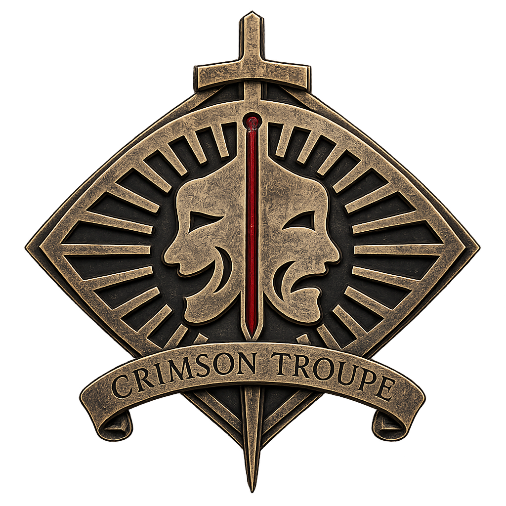

# 剧团 Logo 非默认版本

本目录保存已经由项目负责人要求保留、但尚未指定运行时消费者的团标版本。来源与权利边界见 [`../../sources/troupe-logo-provenance.md`](../../sources/troupe-logo-provenance.md)，默认规则见 `BP-CNT-PRODUCTION-VISUAL`。

除非项目负责人明确指定具体消费位置，网站始终使用 D 版“档案凹印”。本目录不参与构建，页面和构建器不得直接读取这些文件；选定变体后，应将唯一运行时副本迁入 `src/assets/brand/`，再由对应组件显式引用。

## A｜舞台印章

- 状态：已保留，非默认；
- 用途：只有后续人工明确指定具体消费位置时，才进入对应实现；
- 禁止：不得因表站、里站、污染等级或页面位置自动替换默认 D 版；不得由构建器或页面直接读取本目录。

## D-Warm｜暖幕凹印

- 状态：已保留，非默认，暂无运行时消费者；
- 视觉：保留 D 的旧金与深红结构，整体更偏暖棕、低照度，外围带克制的舞台环境光；
- 建议用途：固定深色或暖棕背景上的低调品牌陈列、档案页插图或非交互性场景物件；
- 限制：虽然文件包含 alpha 通道，但暖色光晕属于画面的一部分，不适合作为任意背景上的通用透明小图标。

## D-Bright｜舞台亮金

- 状态：已保留，非默认，暂无运行时消费者；
- 视觉：相较默认 D 提高约 22% 的可见像素加权亮度，金属层次更清楚，红色中轴更醒目；
- 建议用途：固定暗色舞台、专题头图、重点档案物件等需要中高强调度的场景；
- 限制：外围仍有暖色环境光，接入前必须在目标背景、桌面和窄屏尺寸下检查边缘融合与文字辨识度。

## D-Radiant｜辉光亮金

- 状态：已保留，非默认，暂无运行时消费者；
- 视觉：相较默认 D 提高约 41% 的可见像素加权亮度，旧金趋向仪式性高光，外围暖光最强；
- 建议用途：庆典、凯旋、邀请函主视觉或其他明确需要高强调度的独立画面；
- 限制：不作为页头通用 Logo，也不应在浅色背景或高信息密度区域未经验证直接使用。

## 选择规则

- `stage-plate.png` 表示另一套舞台印章构图；三个 `archive-engraving-*` 文件是 D 版构图的环境光与亮度变体，二者不可混为同一版本序列。
- 变体选择必须由具体页面目标、背景和强调层级决定，不以表站／里站、污染等级、语言或路由自动推断。
- 接入运行时前至少复核背景融合、320px 窄屏辨识度、相邻 HTML 品牌名、替代文本、性能和减少动态效果；变体不得成为唯一可读身份。
