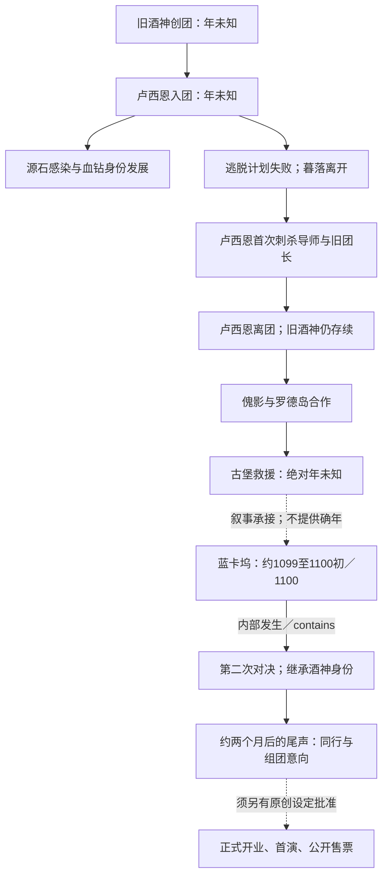
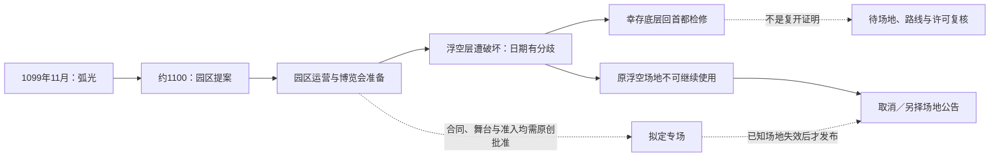

# 泰拉巡演与双站时间关联研究

## 结论

年鉴对排期最有用的不是把所有事件挤成一条精确时间线，而是确定哪些身份、地点和叙述在某个时间点已经成立，哪些尚未成立，哪些仍未知。旧酒神第一次遭刺杀、古堡救援、蓝卡坞最终继承是不同节点；“新酒神出现”与“新团获准正式售票”也不是同一天的同一事实。[^41][^42]

对地区应优先使用“城市—地块—场馆—连接路线”的最小影响范围。螺旋桨天堂原浮空层毁损，可以否决原场地继续使用；幸存地块检修却不能证明立即恢复营业，更不能把事故扩大成哥伦比亚全国停演。[^45][^46] 新沃尔西尼约 1099 才建立，而不是一座可以直接放入 1084 普通排期的新城市；原作 1100 年一周年提供了明确的交叉约束。[^49][^50]

对于“明确可以举办”，目前大多只能证明某地存在公共文化活动、接待能力或交通基础，不能同时证明猩红剧团的合同、演员、场馆与准入。更可靠的结论分为三档：**证据相容的候选、受阻或否决、证据不足**。没有负面记载不能获得肯定结论。

下文保留研究基线和候选判断，不直接约束产品。已采纳部分的项目因果见[时间敏感内容作者前提](../../project/temporal-context.md)，编辑审查见[时间内容审核方法](../../guides/temporal-content-review.md)，运行时行为由正式蓝图维护；本研究的未采纳候选与日期分歧不随迁移变成产品事实。

## 一、八条时间轴与三类关系

| 时间轴                              | 要回答的问题                         | 常见误用                                   |
| ----------------------------------- | ------------------------------------ | ------------------------------------------ |
| 事件时间 `event_time`               | 灾害、入团、继承或城市成立何时发生？ | 用活动上线日或漫画出版年替代               |
| 机构获知时间 `institution_known_at` | 剧团何时知道足以决定改期的信息？     | 作者知道真凶，便让当时的售票员也知道       |
| 发布时点 `published_at`             | 这一版本的通知何时写出？             | 将灾后结论放进灾前公告而不说明回填         |
| 捕获时点 `captured_at`              | 页面副本保存于何时？                 | 把未来预告读成已经演出；把捕获日读成损坏日 |
| 损坏时点 `damaged_at`               | 这一份副本实际何时受损？             | 因事故日期已知，便默认副本也在当天损坏     |
| 损坏发现时点 `damage_discovered_at` | 何时首次确认副本无法完整读取？       | 将发现问题的时间当作实际损坏时间           |
| 观察时点 `observed_at`              | 访问者处于哪个时间层？               | 浏览器现实时间改变 1084 页面内的历史事实   |
| 声称日期 `claimed_date`             | 纸张或污染内容写着什么日期？         | 把异常物件落款当作官方事件确日             |

历史页面可以在捕获时展示已经公布的未来排期；但它不能自然知道后来才发生且未被预报的事故。相反，1096 年捕获的副本在 1100 年被损坏，在时间上完全可能。要把损坏归因于一场地方灾害，还需要副本所在设施、损坏发生期或迁移故障等机制证据；“日期能排得下”不等于“已经证明因果”。

关系也必须分开：

- **先后**：先入团、后可能参演；不意味着每场都参演。
- **因果或物理影响**：场地毁损导致原空间不可用；影响不自动扩展到同国另一座城市。
- **创作关联**：旧团散乱可以启发缺页档案，但原作并没有因此证明某个网页副本损坏。

结构化关系存于 [`event-network.json`](event-network.json)。它引用 [`events.csv`](events.csv) 的稳定 ID，不重复维护日期；建议节点带 `proposal_` 类型，不能被当作官方事件或运行时事实。只有 `precedes` 表示严格先后；`narrative_precedes` 保留二手叙事判断，`motivates_candidate` 只表示草稿灵感。

## 二、剧团身份、演员与邀请的时间链

### 事件线路

图是关键关系的阅读示意，不表示每条边紧邻，也不把节点之间的空白年全部填满。蓝卡坞是《红丝绒》的叙事背景节点，继承发生在其内部；JSON 不将两者误建为“整件蓝卡坞事件结束后才继承”的严格时间边。

AD-8 的回溯直接区分早年刺杀与后来的再次对决；这使“旧团垮塌”至少有两种含义：早期成员与组织遭受破坏，但旧酒神存续；后期则发生掌权者与继承身份的根本变化。仅写“古堡事件后”不足以判定属于哪一个阶段。[^41] 古堡救援的绝对日期仍未确定，不能用肉鸽解锁顺序或一个回忆画面替代纪年。[^3]

### 身份适用条件

| 阶段                     | 可以讨论的身份                       | 排期中必须核实的条件                                             | 不能自动带入                         |
| ------------------------ | ------------------------------------ | ---------------------------------------------------------------- | ------------------------------------ |
| 旧团成立后、卢西恩入团前 | 旧酒神与尚未明确名单的旧团           | 先说明所选年为项目自定背景，不能伪称官方场次                     | 卢西恩已经主演、血钻艺名、罗德岛经历 |
| 入团及受训阶段           | 卢西恩作为团员；具体舞台身份逐渐形成 | 场次晚于入团及相应角色形成；另证实际参与                         | 入团当天即成为所有剧目的主演         |
| 首次反抗与离团之后       | 旧酒神存续，旧成员结构已改变         | 旧节目单与新场次分开；已死亡导师、离团演员不能自动继续当在岗卡司 | 把这次反抗等同最终继承               |
| 古堡救援阶段             | 傀影、暮落与古堡叙事                 | 把特殊召回、幻象舞台和正常跨国巡演分开                           | 把多个结局编成逐年举行的巡演         |
| 蓝卡坞继承之后           | 卢西恩为后继酒神                     | 旧团历史可保留，但同期机构声口与负责人须区分                     | 旧长生者仍以同一现任身份继续经营     |
| 尾声与重建意向之后       | 卢西恩、暮落、剧作家的新方向         | 正式开业、签约、售票另属项目延续设定                             | 把同行邀请变成当日九国巡演公告       |

1084 是否处于卢西恩已入团、仍在团的阶段，证据不足。由此既不能写“官方证实 1084 有血钻参演”，也不能写“1084 一定不可能”。人工若选择原创自定年，需要同时满足入团、艺名形成、反抗、离团、救援与继承的相对约束。角色通用介绍、具体卡司名单和旧照片上的人物还应分开；只有最后两类才可能直接声称参加某场演出。

### 邀请的四种身份

102X 年的子爵请柬记载城堡当时已完成，提到未指名的云游剧团。它支持**请柬日期的十年范围**与**城堡竣工不晚于请柬**，不支持“城堡必建于 1020—1029”，更不证明被邀请的就是猩红剧团。旧团帐篷宣传及古堡大门面向演员、观众的邀约则属于另一类材料，不能把所有邀请都限制在古堡救援之后。[^40]

还要将后继酒神邀请同伴，与网站针对当前访问者的《摇篮曲》污染回应分开。原作尾声的首幕位于两个月后，电影节回到其前一天，故宜写“约两个月”，不能设置“至少两个月”的严格时间下界。[^42] 网站异常回应可以声称一个历史日期，但是否对应官方救援、由谁发出、在何时侵入副本，均须另行决定。

## 三、螺旋桨天堂：取消排期的完整示例

螺旋桨天堂位于麦克斯特区外缘，而非特里蒙；弧光发生地与后来园区所在地是不同城市。原作园区已运营、展会临近的描写可以支持“场地洽谈的背景”，却没有证明猩红剧团已经签约或有可出租剧场。设施遭损毁后的原浮空空间与幸存底层也不能共用一个无版本的“可用”标记。[^43][^44][^45][^46]

**日期不能简单定为 1102。** 中文 PRTS 年表列为 1101 年末，莱茵生命组织史也将其归在 1101 年；英文年表依据圣诞前、弧光约两年前等线索推为约 1101 年 12 月下旬；日文简易年表则列在 1102 年春。中文与英文支持同一候选分支，但它们仍是社区时间判定，不能凭多数票删除日文分歧。组织史中的其他事件日期也不能移作事故确日。活动名称含 1102 不能单独裁决事故年份。P003、D10—D12、D15 保留这组主张。[^1][^3][^47][^62][^63]

对当前表站的固定时间 `1102-04-15`，应作分支分析：

| 假定的世界时间分支       | 当时是否可以写灾后取消               | 还缺什么                                     |
| ------------------------ | ------------------------------------ | -------------------------------------------- |
| 采用约 1101 年末的判定   | 时间上可以                           | 原创签约、机构获知和取消通知的时点；场地身份 |
| 保留 1102 年春、没有月日 | 无法保证                             | 事故可能在 4 月 15 日之前，也可能之后        |
| 不裁决绝对日期           | 可先保存相对案例，不进入现有确日场次 | 人工决定采用的设定分支                       |

兼容史实的原创案例应有五步：先批准筹演及签约假设；再确认所选日期园区已存在；事故或有效场地通知触发取消；保留原定日期与原场地；复开没有证据时维持待评估。这里的原创假设不是“原作有这样一场演出”，也不是要创造真实对外售票关系。

公开取消原因宜仅说明浮空层事故、场地无法使用或检修。即便研究者知道阴谋线索，剧团公告也未必已经取得可公开归责的证据。文案候选、快照表述和审批项见建议草稿，不在此将其写成当前 UI。

## 四、地区影响与举办窗口

“候选窗口”只表示历史背景相容；“暂停建议”是保守的项目运营判断，不是官方全国禁令。恢复均需检查**场地、路线、人员、主办方准入与信息可知性**，不能把战争结束日直接填为售票恢复日。

| 国家／具体地区             | 时间锚点与作用范围                                 | 可考虑的动作与终止条件                                                                    | 证据                       |
| -------------------------- | -------------------------------------------------- | ----------------------------------------------------------------------------------------- | -------------------------- |
| 维多利亚／伦蒂尼姆         | 1084 已存在；较晚的占领、围城及重建并非1084事件    | 1084仅为候选；1097—1098普通外来公众巡演宜暂停核准，战后逐馆恢复，不否定秘密或特殊演出存在 | V001、V002、V005；[^57]    |
| 维多利亚／卡拉顿           | 1097年末局地火灾、治安事件                         | 涉事街区改期；不能认定全城在两个月内持续关闭                                              | V004；[^56]                |
| 乌萨斯／切尔诺伯格         | 1096年末危机、城市损毁及关联路线                   | 对损毁场地取消；危机终结不自动解除每条线路的限制                                          | U006；[^58]                |
| 乌萨斯／其他城市及边境     | 1072战争与1073—1075政治变化；各地暴露不同          | 1084没有统一“全国禁止演出”的结论；需当地赞助与准入，不能以一个首都状态覆盖全国            | U003—U005；S23             |
| 叙拉古／旧沃尔西尼         | 有歌剧及小型舞台文化；1099新城争夺另属后期         | 1084可作为替换新城的研究候选，场馆仍须原创审核；后期家族冲突按街区处理                    | [^48]                      |
| 叙拉古／新沃尔西尼         | 约1099形成；1100周年庆与局地暴力并存               | 1084排期的城市身份否决；1100后可谈文化合作，但港区、街区与演出许可分别确认                | S004—S006；[^49][^50][^61] |
| 米诺斯／雅赛努斯           | 1041解放、1042撤军；1100有跨国文化交流             | 1084不应仍称被萨尔贡占领；文化中心是候选背景，不证明本团到访或获准使用神殿                | M003—M006；S27、S28        |
| 莱塔尼亚／沃伦姆德         | 约1097秋大裂隙、商路阻断；次春撤并                 | 商路中断时暂停；旧聚落撤并后不得继续沿用旧场馆地址作为正常现址                            | L003、L004；[^55]          |
| 莱塔尼亚／其余城市         | 1077起为双子女皇时代；旧团到访该国有报告线索       | 优先寻找有依据的合作城市；沃伦姆德事件不能禁掉维谢海姆或首都全部场次                      | L002、T013；[^9]           |
| 卡西米尔／卡瓦莱利亚基     | 1097锦标赛体现大型活动与接待能力                   | 可作为节庆联动洽谈背景；赛事、天气风险、票务和外来剧团资格分别评估，不倒推1084同样条件    | K002；[^60]                |
| 东国／御机、南方及北方边境 | 南北制度与1072边境战事有地域差别                   | 1084并非因“古代”而无法进入；跨境路线与地方准入未知，南方条件不套北方                      | H002、U003；S32、S37       |
| 炎／玉门                   | 1082背景事件及1102年3月风波；守城和对接条件        | 当前时间层可检查局地路线；不认定炎国全国停演，也不保证1084可常年接纳外国剧团              | Y007；[^59]                |
| 炎／龙门                   | 1096年末至1097年初与切尔诺伯格相关危机             | 相关交通、中心街区和场馆可延期；不得把龙门事件传播到全炎国                                | U006；[^58]                |
| 哥伦比亚／蓝卡坞           | 约1099—1100案件及剧团继承；片区受损                | 新旧团断代与受损片区分开；影片制作、城市行业与全国巡演不同时停摆                          | T015—T017；[^41][^42]      |
| 哥伦比亚／特里蒙及首都园区 | 弧光与螺旋桨天堂相互有关但不在同一地点             | 分别处理特里蒙当地风险和首都外缘设施失效，不能共用一个全国产能开关                        | C010、P001—P004；[^43]     |
| 独立城邦／旧、新汐斯塔     | 1097迁城计划，1099旧址受火山影响；不是哥伦比亚领土 | 原地址失效，可改谈新移动城；旧地图失效不等于档案文件也损坏                                | X001、X002；[^53][^54]     |

对于表中没有确日的状态，不生成任意“每年某月开始巡演”“战后七天恢复”之类规则。某国首次出现在官方记录中，仅是目前证据的最早可见点，不等于该团首次真正到达的日期；最后一次记录也不证明从此永久停演。

## 五、1084 的可达性与巡演编排

里站较旧的网页技术与审美，不能直接推出泰拉交通处于中世纪。炎国驰道很早便开始建设，移动城市与地块对接也有独立的工业背景；现代城况同样不能整体回填至 1084。[^51][^52] 最稳妥的方法是把**有过巡演的证据强度**与**地理运输难度**分开排序。

| 编辑优先级（建议）   | 适用国家或范围                     | 理由与限制                                                         |
| -------------------- | ---------------------------------- | ------------------------------------------------------------------ |
| 优先维持的旧团核心   | 维多利亚；再核莱塔尼亚、叙拉古     | 有主要活动地及巡演国家的材料；仍未给出1084逐城逐场记录             |
| 有关联但须单独核路线 | 哥伦比亚；九国之外的萨尔贡         | 前者有案件线索，后者有巡演报告；不能把异常案件自动称为正常商业演出 |
| 拓展候选而非自动补齐 | 炎、东国、米诺斯、卡西米尔、乌萨斯 | 文化与交通可能相容，但本轮不足以证明旧团实际行程                   |

这不是国家间公里数排名。没有同时期地图尺度、城市移动位置、跨境口岸、载具和剧团规模，不能编造维多利亚到炎国的运输天数。近程为主可以成为经人工批准的旧团编辑策略，而不能假装是官方交通定律。[^9]

合理的排期应先决定是否同一演员组与同一套大型布景跨国移动，再检查装台、撤台、维护、陆舰或车队、补给、译务、赞助与许可。若存在分团、驻地替演或装备就地租赁，应明确记为项目设定；不能为解释过密排期而事后默认拥有无限套卡司。

对现有里站中炎国与中部城市之间不足一月的往返，最合适的判定是“交通与制作缓冲待解释”，不是未经速度证据便判物理不可能。语言版本的数量不要求九国等额安排演出；翻译成炎语只是页面可被该语言阅读，不等于这一季已经抵达炎国。

## 六、失效历史页面的候选节点

| 候选节点             | 可用时间表达                           | 合理的失效性质                               | 必须补充的原创前提                                               |
| -------------------- | -------------------------------------- | -------------------------------------------- | ---------------------------------------------------------------- |
| 旧团首次反抗附近     | 相对T021；暂不指定1093或1096           | 节目单缺页、人员名单版本不一致、旧版联络失效 | 哪份资料保存于何处；是谁、何时删改；不能由导师死亡自动推网站损坏 |
| 古堡召回或救援       | 事件前、同期、事后分别存档；绝对年未知 | 邀约异常、页面声称日期与观察时间不一致       | 明确指哪一种邀请，不把全部邀请设为救援后的产物                   |
| 蓝卡坞交接期         | T016以后；正文发布与捕获分别记         | 旧团页面封存、联系人替换、重建公告候选       | 官方不证明域名、服务器或网页存在；组织交替不自动造成技术故障     |
| 螺旋桨天堂事故       | P003前已存在的专场版本，P003后观察     | 原场地失效、取消通知；文件可完整可读         | 先批准剧团签约和页面生成；可另设副本损坏，但需额外机制           |
| 沃伦姆德撤并         | L003至L004及以后                       | 旧地址、联系点或路线失效                     | 是否有本团合作方；不能把整个国家入口变为坏页                     |
| 旧汐斯塔迁移         | X001计划阶段与X002以后                 | 旧地图、海岸场馆地址失效；新城入口可继续工作 | 确认旧／新地址的继承关系；失效不必表现成乱码                     |
| 现有1093与1096损坏项 | 仅保留项目已知的副本年份               | 原因未定的馆藏损坏                           | 不强行套某场灾害；可以另设更晚损坏时间，但应交代证据来源         |

伪快照应是世界内叙事物件，不是对真实访问者的欺骗工具。推荐将“页面未生成”“副本损坏”“链接失效”“场地已撤除”“无法认证日期”分别表达；没有文件可读时不要伪造正常预约成功，不影响返回表站或可靠关闭对话框。

## 七、采用前的敏感度检查

新增一场演出，依次检查：**地点当时存在 → 组织与卡司当时成立 → 原场地与路线可用 → 当时机构能知道并发布 → 所选快照能包含这个版本 → 展示层没有伪装成另一时代**。任一步为未知时保留待核，不把缺值转成通过。

敏感度不宜压成单一分数。身份传承与城市生命周期属于高优先级约束；局地治安、运输和场馆状态属于条件审查；长期文化气质与网页复古程度只影响编辑选择。前两者可能否决具体记录，后者不能覆盖明确的日期和实体冲突。

地区影响沿真实依赖传播：场馆位于毁损地块、路线经过封闭口岸，才关联相应场次。国家、界面语言、网页主题和城市译名本身都不是传播路径。新增关系建议还应有失效终点或“恢复未知”说明；旧事件不能无限期冻结全国，也不能在缺少恢复证据时自动清除。

## 来源与证据边界

来源身份、访问日期及方法的完整登记见 [`sources.csv`](../../sources/terra-chronology/sources.csv)。以下脚注编号对应稳定来源 ID。PRTS 与各语言 Wiki 的官方文本转载不等于原客户端画面已复核；英文部分使用搜索索引，日文简易年表是社区研究，均保留限制。原作人物对白还可能有知识范围与叙述立场，不自动视为普通剧团公告可用的信息。

[^1]: PRTS，[泰拉年表](https://prts.wiki/w/泰拉年表)，1101年末条目；社区纪年。

[^63]: PRTS，[泰拉大典：组织／莱茵生命](https://prts.wiki/w/泰拉大典:组织/莱茵生命)，历史1101年条目；只支持年份，不把同一年度其他事件的月日移用至园区事故。

[^3]: Arknights Terra Wiki，[Arknights Timeline](https://arknights.wiki.gg/wiki/Timeline)，社区年表及脚注11、20；约数、归类和推导不等于官方确日。

[^9]: Hypergryph 衍生资料转载，[Supplemental Investigation Report](https://arknights.wiki.gg/wiki/Supplemental_Investigation_Report)，世界内调查档案；无本轮可确认的绝对落款。

[^40]: PRTS，[傀影与猩红孤钻／猩红珍藏](https://prts.wiki/w/傀影与猩红孤钻/猩红珍藏)，游戏物件及背景文字转载；子爵请柬、帐篷传单、古堡大门。

[^41]: 游戏剧情转载，[AD-8 Before／After](https://arknights.wiki.gg/wiki/AD-8/Story)，旧计划、首次刺杀、再次对决及继承。

[^42]: 游戏剧情转载，[AD-ST-3](https://arknights.wiki.gg/wiki/AD-ST-3)，尾声的相对时间、影片制作及影院对话。

[^43]: Arknights Terra Wiki，[Propeller Paradise](https://arknights.wiki.gg/wiki/Propeller_Paradise)，设施与区域二手综述。

[^44]: 游戏剧情转载，[UR-ST-1](https://arknights.wiki.gg/wiki/UR-ST-1)，园区运营与展会准备。

[^45]: 游戏剧情转载，[UR-8](https://arknights.wiki.gg/wiki/UR-8/Story)，浮空层破坏及残骸。

[^46]: 游戏剧情转载，[UR-ST-3](https://arknights.wiki.gg/wiki/UR-ST-3)，回航检修与后续谈判。

[^47]: アークナイツ攻略 Wiki，[時系列考察／簡易年表](https://arknights.wikiru.jp/?cmd=read&page=%E6%99%82%E7%B3%BB%E5%88%97%E8%80%83%E5%AF%9F%2F%E7%B0%A1%E6%98%93%E5%B9%B4%E8%A1%A8)，社区时间分类。

[^48]: Arknights Terra Wiki，[Volsinii](https://arknights.wiki.gg/wiki/Volsinii)，旧城文化与新城建设史。

[^49]: 游戏剧情转载，[PV-ST-1](https://arknights.wiki.gg/wiki/PV-ST-1)，1100年11月5日与新城一周年；这是剧情内日期，不是现实发布日期。

[^50]: 干员档案转载，[Vigil/File](https://arknights.wiki.gg/wiki/Vigil/File)，旧城事件与新城行政安排。

[^51]: Arknights Terra Wiki，[Nomadic city](https://arknights.wiki.gg/wiki/Nomadic_city)，技术与地块连接综述。

[^52]: Arknights Terra Wiki，[Yan/Overview](https://arknights.wiki.gg/wiki/Yan/Overview)，驰道与交通背景。

[^53]: 游戏剧情转载，[SL-1](https://arknights.wiki.gg/wiki/SL-1/Story)，迁移计划与预计时间的广播。

[^54]: Arknights Terra Wiki，[Siesta](https://arknights.wiki.gg/wiki/Siesta)，旧址、新移动城与独立地位。

[^55]: Arknights Terra Wiki，[Wolumonde](https://arknights.wiki.gg/wiki/Wolumonde)，商路、起义与撤并。

[^56]: Arknights Terra Wiki，[A Light Spark in Darkness/Synopsis](https://arknights.wiki.gg/wiki/A_Light_Spark_in_Darkness/Synopsis)，卡拉顿事件梗概。

[^57]: Arknights Terra Wiki，[Londinium](https://arknights.wiki.gg/wiki/Londinium)，占领、围城与重建背景。

[^58]: Arknights Terra Wiki，[Chernobog Crisis](https://arknights.wiki.gg/wiki/Chernobog_Crisis)，城市危机阶段。

[^59]: Arknights Terra Wiki，[Yumen](https://arknights.wiki.gg/wiki/Yumen)，守城、对接及冲突背景；1102年3月定位另见S03。

[^60]: Arknights Terra Wiki，[Kawalerielki](https://arknights.wiki.gg/wiki/Kawalerielki)，赛事、接待与灾害预报背景；比赛区间另见S03。

[^61]: 游戏剧情转载，[PV-9](https://arknights.wiki.gg/wiki/PV-9/Story)，节庆期间地方冲突。

[^62]: 游戏剧情转载，[UR-ST-2](https://arknights.wiki.gg/wiki/UR-ST-2)，与圣诞前有关的时间线索；英文年表的具体推导另见S03脚注20。
